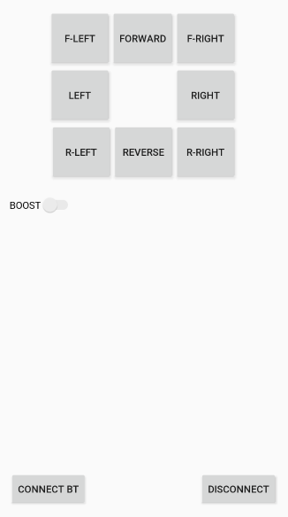

# EGEN 310 Control Application 

> I worked along with four engineer students to design and build a Remote Control Vehicle (RCV) that is capable of navigating the Cat's Conundrum obstacle course for EGEN310. This Android application connects to a HC-05 Bluetooth module running on an Arduino Uno. 

## Installation

Download the source code folder and compile it in Android Studio while a compatibale smartphone is plugged in. 


## Connecting
  - Turn on Bluetooth under settings on device
  - Find 'HC-05' in nearby devices and click connect
 
In Control Application:
  * Tap the 'Connect' button
    * Tap 'Disconnect' when finished with application

## Tech
Tech/devices used for this project:
* HTC Desire Eye
    * Android Version: 5.0.2
    * SDK API level: 6.55
* HP Pavilion Desktop 690-00xx
* HC-05 Bluetooth Module
* Arduino Uno

## Troubleshooting
If there is a Gradle Migration Settings error, make sure this line
```java
<component name="GradleMigrationSettings" migrationVersion="1" />
```
is within `\path\to\project\.idea\gradle.xml`.

## Source Code 
If you are interested in modifying the source code or interested how it is set up, go to [README.md](/app/README.md).

## Images
Prototype 1:  Prototype 2:

### Works Cited
* https://developer.android.com/guide/topics/connectivity/bluetooth
* Fahad, Engr. “Android App Development to Control Arduino over Bluetooth, Android Studio.” Electronic Clinic, 3 Aug. 2019,             www.electroniclinic.com/android-app-development-to-control-arduino-over-bluetooth-using-android-studio/.


